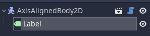

# Creating Grid-Aligned Objects

## The Easy Way
1. Create a new scene
	- Probably safest use `Node2D` in most cases
2. Add a new AAB2D node to the scene
	- Click the '+' button (in editor)
	- Search for `AxisAlignedBody2D`
3. Customize
	- Edit the `collider_size` via the inspector
	- Control whether the object is movable with the `is_movable` inspector property
	- Add any other child nodes (sprites, etc.)
	- **You DO NOT need to add collision shapes or raycasts for pushing to work, these are added automatically**

## The More Complicated Way 
For creating a reusable base object that can have variants with different properties.

See `SampleObject` for a complete example.

The following steps will explain how to create a pushable sign node that you can create multiple instances of, each with different text (editable with the inspector).

1. Create an Inherited Scene based on AAB2D
	- In the top left menu, click `Scene > New Inherited Scene` (`CTRL+SHIFT+N`)
	- Navigate to `Mechanics/GridPhysics/AxisAlignedBody` in the file window that pops up and select `AxisAlignedBody2D.tscn`
2. Extend the AAB2D script
	- In the tree for the inherited scene, right click the root node (this should be an `AxisAlignedBody2D`) and select 'Extend Script'
	- Please give the script a unique name
	- The root AAB2D node should now have a script attached to it that `extends AxisAlignedBody2D`
3. Make the script a tool
	- You don't need to do this unless you want to add exported fields to the node that can be modified in the editor inspector with immediate visual feedback
	- Add `tool` to a new line at the top of the extended AAB2D script (above everything - it should be the first line in the file)
4. Add a `Label` node to the scene
	- In the tool script created before, add a line `onready var label = $Label`
	- This gives the script access to the label node you just added to the scene
5. Add a `text` property to the script
	- Add this line: `export var text = "" setget _on_text_changed`
	- Add this function: `func _on_text_changed(new_text):`
	- You have just created an exported property for the custom node, which can be modified using the editor inspector
	- When the property is modified in the editor, `_on_text_changed` is called with the new value
6. Implement `on_text_changed`
	- Apply the new value: `text = new_text`
	- Update the label and the node itself:
		```gdscript
		if label:
			label.set_text(new_text)
		update()
		property_list_changed_notify()
		```
	- Now when the `text` property is changed from the editor, the new value is stored and used to update the label (and re-render the node)
7. Implement `_ready`
	- Apply the exported text value to the label: `label.set_text(text)`
	- This ensures that the label receives the right value when the scene is actually loaded at runtime
8. Instance the scene wherever
	- You should be able to introduce instances of this custom scene to any other scenes, and edit the text displayed for each individual one.

Just in case something went wrong, this is what the scene tree should look like:


And this is the script:
```gdscript
tool
extends AxisAlignedBody2D

export var text = "" setget _on_text_changed

onready var label = $Label

func _on_text_changed(new_text):
	text = new_text
	if label:
		label.set_text(new_text)
	update()
	property_list_changed_notify()
	

func _ready():
	label.set_text(text)
```

## Other Notes
- If you want to update an exported property when the AAB2D's collider size is changed, override `_on_size_changed` making sure you call the super implementation: `._on_size_changed(size)` (`SampleObject` does this if you need a full example)
- If you don't want to export AAB2D's properties in the editor alongside your custom properties, don't create an inherited scene and don't extend the AAB2D script; instead, just create a new scene (with any node type), attach a script, and add an AAB2D node. You can export properties from that new script without needing to extend AAB2D.


# Structure

## GridProperties

An autoloaded script that defines the `TILE_SIZE`.

## AxisAlignedBody2D

A `KinematicBody2D` whose position and movement are fixed to an underlying grid (16x16).
A `RayMatrix2D` and `CollisionShape2D` are generated automatically based on the `collider_size`.

#### Properties

`collider_size: Vector2`

The size of the body in grid tiles. (`width`, `height`)

`is_movable: bool`

Whether the body can be moved by pushing.

## RayMatrix2D

An axis-aligned matrix of `Ray2D`. Used to enable collisions between `AxisAlignedBody2D` that occupy multiple grid tiles.

#### Properties

`size: Vector2`

The size of the matrix in grid tiles (`width`, `height`).

## Ray2D

A wrapper for `RayCast2D`. Provides some extra utilites for managing the raycast.

## GridPlayer
An implementation of the player based on `AxisAlignedBody2D`. The player is fixed to a tile grid and can push other `AxisAlignedBody2D` nodes (provided they set `is_movable` to true).